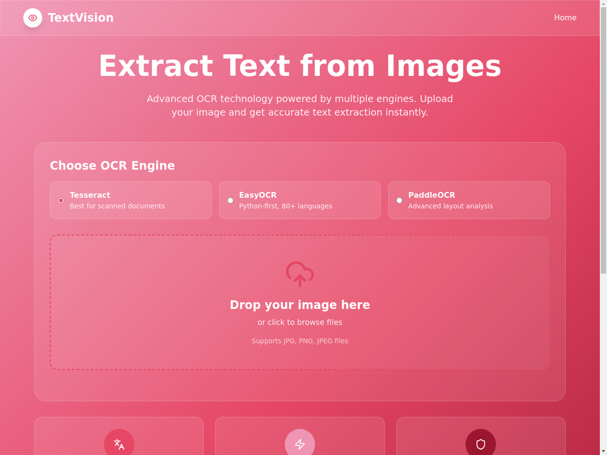

# TextVision - OCR + AI

## Features

TextVision combines fast, accurate OCR with an AI assistant. After extracting text from images, the AI can **answer questions, summarize, or explain the content** with one-tap length controls: **20 words**, **50 words**, or **100 words**.  

It supports multiple OCR engines (Tesseract, EasyOCR, PaddleOCR) for diverse documents and languages, processes images in seconds, and respects privacy by avoiding server-side storage of user images.

## Design & Technology Stack

TextVision features a clean, modern, responsive UI with a vibrant pink gradient. Users can quickly upload images, choose an OCR engine, and then ask the integrated AI to analyze or explain the extracted text with smart length presets (20/50/100 words).

**Built with:**

- **React** – UI components and state.
- **Vite** – lightning-fast dev/build.
- **shadcn/ui** – elegant, accessible components.
- **Tailwind CSS** – utility-first styling.
- **OCR** – Tesseract, EasyOCR, PaddleOCR for robust text extraction.
- **GROQ API** – AI reasoning and summarization powered by the **Compound (beta)** model for concise answers and explanations.

## Developer

TextVision was created by **Abdul Rauf Jatoi**, a Full Stack Developer & AI Enthusiast, passionate about building intelligent tools and exploring new technologies.

Website: [https://raufjatoi.vercel.app](https://raufjatoi.vercel.app)
GitHub: [https://github.com/Raufjatoi](https://github.com/Raufjatoi)

TextVision:[https://text-vision.vercel.app](https://text-vision.vercel.app)

